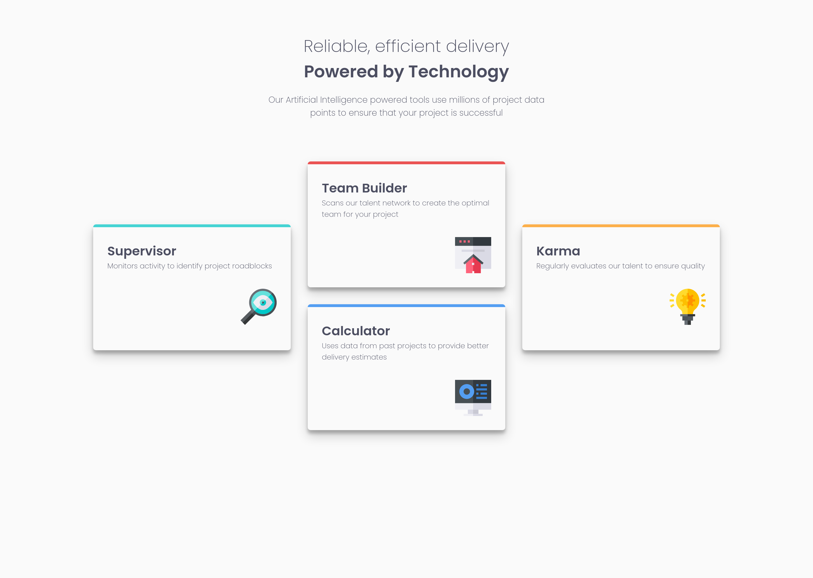
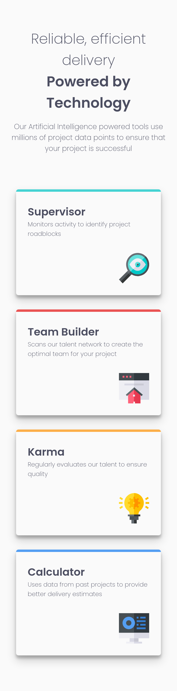

# Frontend Mentor - Four card feature section solution

This is a solution to the [Four card feature section challenge on Frontend Mentor](https://www.frontendmentor.io/challenges/four-card-feature-section-weK1eFYK). Frontend Mentor challenges help you improve your coding skills by building realistic projects.

## Table of contents

-   [Overview](#overview)
    -   [The challenge](#the-challenge)
    -   [Screenshot](#screenshot)
    -   [Links](#links)
-   [My process](#my-process)
    -   [Built with](#built-with)
    -   [What I learned](#what-i-learned)
    -   [Continued development](#continued-development)
    -   [Useful resources](#useful-resources)
-   [Author](#author)
-   [Acknowledgments](#acknowledgments)

## Overview

### The challenge

Users should be able to:

-   View the optimal layout for the site depending on their device's screen size

### Screenshot





### Links

-   Solution URL: [Github Repository](https://github.com/juani2/four-card-feature-section-master--solution)
-   Live Site URL: [Netlify](https://wizardly-poincare-e82688.netlify.app/)

## My process

### Built with

-   Semantic HTML5 markup
-   Vanilla CSS
-   Flexbox
-   Graceful-degradation workflow

### What I learned

In this challenge, I was able to test my understanding with `flex` property.
With minimal media query, I was able to achieve a responsive card layout using the `flex-grow`, `flex-shrink`, and `flex-basis` properties.

The following snippet was responsible for the responsive behavior of card components without using any media query.

```css
.section-content {
    display: flex;
    justify-content: center;
    flex-wrap: wrap;
}

.section-content > * {
    flex: 0 1 23.33rem;
}
```

to achieve the vertical centering of 1st and 3rd card, a CSS `transform` was utilized.

```css
.card:nth-child(1) {
    transform: translateY(50%);
}
.card:nth-child(3) {
    transform: translateY(50%);
}
```

the only media query used in this solution serves as a reset in the `transform` property on smaller screen sizes, this is to avoid overflowing of `.card` components to its parent `.container`.

```css
@media screen and (max-width: 1280px) {
    .card:nth-child(1) {
        transform: translateY(0%);
    }
    .card:nth-child(3) {
        transform: translateY(0%);
    }
}
```

### Continued development

Use this section to outline areas that you want to continue focusing on in future projects. These could be concepts you're still not completely comfortable with or techniques you found useful that you want to refine and perfect.

## Author

-   Github - [John Rey Faciolan](http://www.github.com/juani2)
-   Frontend Mentor - [@juani2](https://www.frontendmentor.io/profile/juani2)

## Acknowledgments

I want to give thanks to Frontend mentor team and all those challengers that posts their solution. It really helped me in pulling this challenge off.
